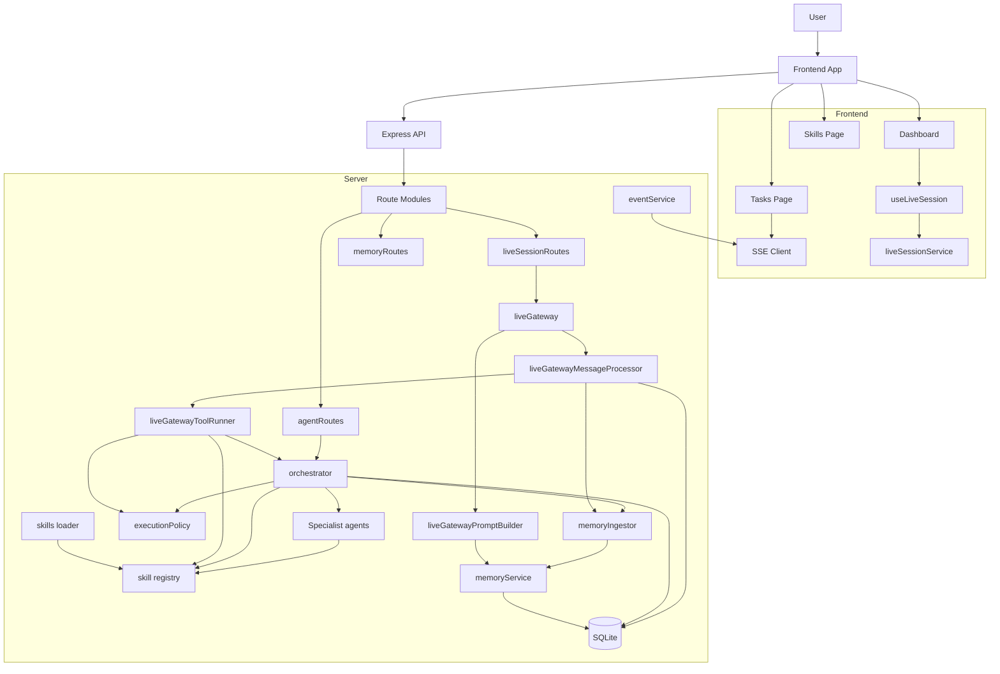
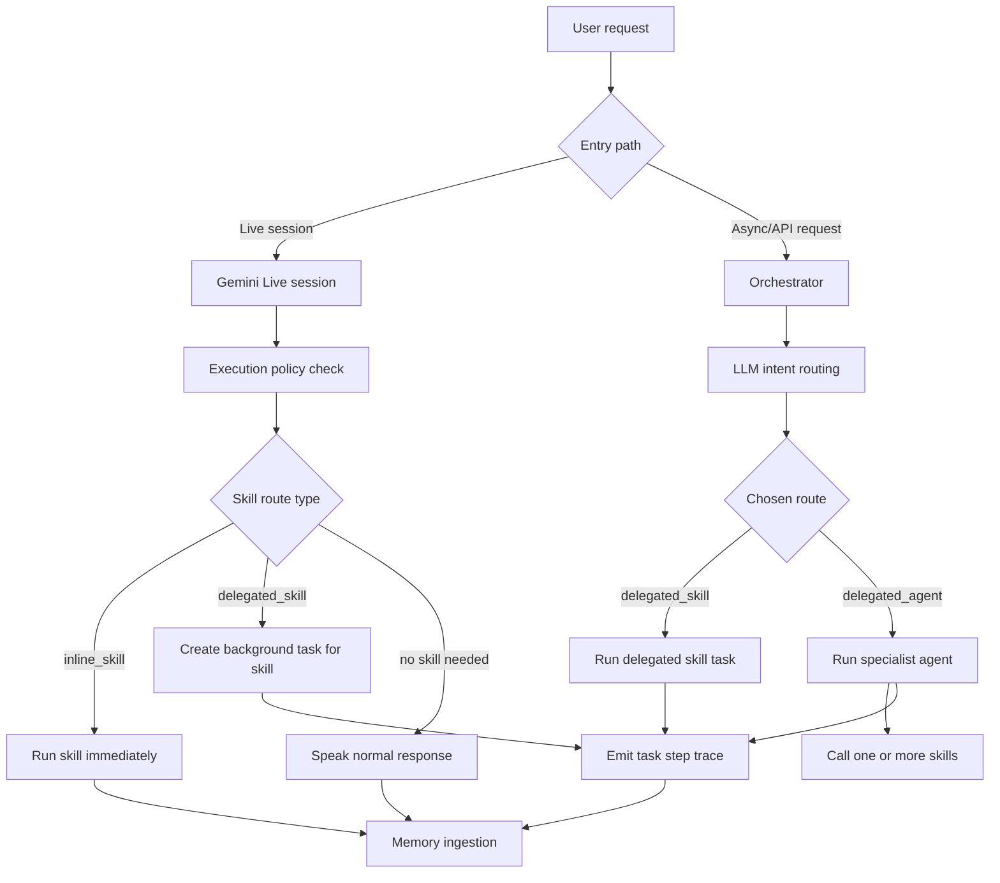
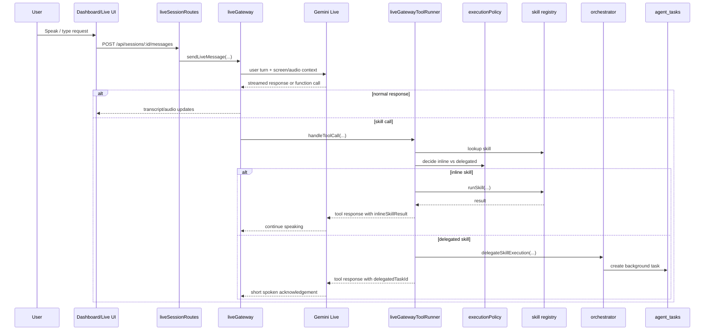
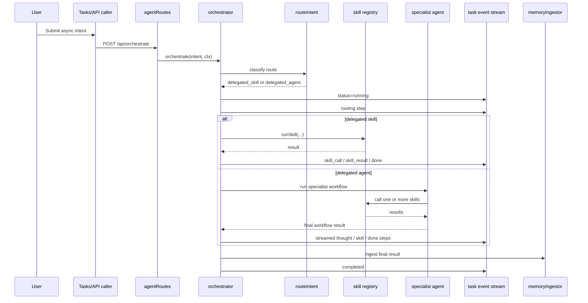
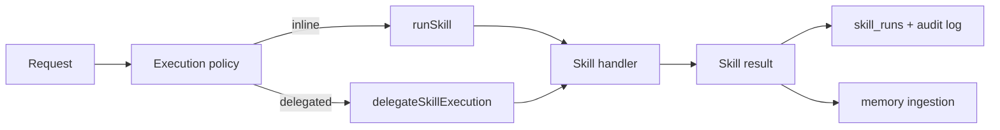
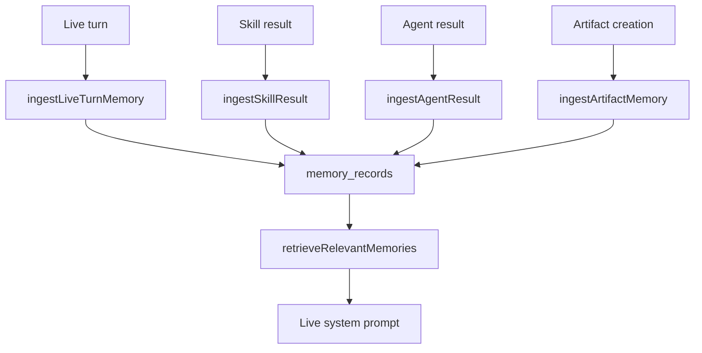

# Agent Architecture

This document explains how the current Crewmate runtime works after the runtime simplification:

- `Gemini Live` is the realtime conversation controller
- `skills` are the single execution primitive
- `agents` are delegated workflow runners for longer multi-step work
- `memory` is a shared supporting subsystem

## Runtime Overview

There are 3 main layers:

1. `Live controller`
- Handles live conversation, turn-taking, interruption, voice, and screen context
- Can run only quick inline skills during the live turn
- Delegates slow or high-impact work into background tasks

2. `Execution layer`
- All real actions run through skills
- Skills define execution policy metadata:
  - `executionMode`
  - `latencyClass`
  - `sideEffectLevel`

3. `Workflow layer`
- Specialist agents run delegated background workflows
- Agents use skills and model calls internally
- Progress streams into the task UI

## High-Level System Diagram

## Core Decision Model

Every request is reduced to one of these route types:

- `inline_answer`
- `inline_skill`
- `delegated_skill`
- `delegated_agent`

The main decision rule is:

- if it is cheap and safe, do it inline
- if it is slow, external, browser-heavy, or high-impact, delegate it

## Request Routing Diagram

## Live Session Flow

Live mode is intentionally not the heavy execution engine anymore.

- Builds system instruction from:
  - core Crewmate identity
  - connected integrations
  - retrieved memory
- Exposes only skill declarations to Gemini Live
- Runs quick inline skills only
- Delegates slow or risky work into a task

## Live Session Sequence

## Async Orchestration Flow

The orchestrator is used for explicit async work and background workflows.

- Routes an intent to either:
  - delegated skill
  - delegated agent
- Creates an `agent_tasks` record
- Emits realtime step events
- Stores results into memory

## Orchestrator Sequence

## Skills

Skills are the only execution primitive in the runtime.

A skill provides:

- ID and description
- input schema
- category
- model preference
- execution policy
- live exposure setting
- actual handler

Important runtime metadata:

- `executionMode`
  - `inline`
  - `delegated`
  - `either`
- `latencyClass`
  - `quick`
  - `slow`
- `sideEffectLevel`
  - `none`
  - `low`
  - `high`

Examples:

- `memory.retrieve` -> inline, quick, no side effects
- `notion.create-page` -> delegated, slow, high side effects
- `browser.ui-navigate` -> delegated, slow, high complexity
- `slack.post-message` -> either, quick, high side effects

## Skill-Centric Architecture Diagram

## Agents

Agents still exist, but only for delegated workflows.

They are no longer the default live execution path.

Their job is to:

- handle multi-step work
- plan and sequence model + skill calls
- emit progress steps
- produce one final result

Common delegated agent categories:

- research
- product
- sales / marketing
- data
- UI navigation

## Where Memory Fits

Memory is not the router. It is supporting context.

It contributes in 2 directions:

1. `Read path`
- live prompt builder retrieves relevant memories
- the assistant starts with context from prior sessions and artifacts

2. `Write path`
- live turns are stored as `session` memories
- skill results are stored as `knowledge`
- created artifacts and links are stored as `artifact`

## Memory Flow Diagram

## UI Surfaces

### Dashboard
- live session control
- recent tasks
- recent activity
- integrations status

### Tasks
- active delegated tasks
- task history
- streamed execution trace
- live-origin badge for tasks created from live sessions

### Skills
- list of available skills
- skill metadata, including execution policy fields exposed by API

## What Changed from the Older Architecture

Old shape:

- live mode used both skills and MCP tools
- long work could block the live turn
- agents, skills, and MCP tools overlapped in unclear ways

Current shape:

- live mode uses skills only
- slow work is delegated into async tasks
- agents are background workflow runners
- skills are the single execution primitive

## Practical Mental Model

Use this model when reasoning about the app:

- `Gemini Live` = conversational controller
- `skills` = verbs / actions
- `agents` = planners for longer workflows
- `tasks` = durable long-running execution state
- `memory` = shared context and recall

That is the current architecture baseline.
