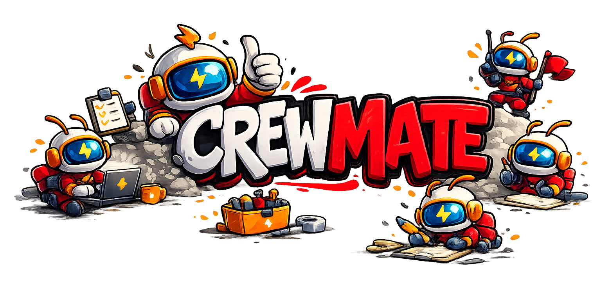

<div align="center">

# ⚡ Crewmate



### Your AI-powered company — run an entire business with a crew of AI agents 🚀

**14 specialist agents · 30+ real integrations · Real-time voice via Gemini Live · Custom skill builder · MCP server**

[](https://ai.google.dev/)
[](https://ai.google.dev/)
[](https://react.dev/)
[](https://www.typescriptlang.org/)
[](./server)

</div>

---

## 🌟 What is Crewmate?

Crewmate is a **full-stack, multimodal AI orchestration platform** built on Google's Gemini ecosystem. Think of it as hiring an entire company's worth of AI specialists — each with their own domain expertise, tools, and real integration access — all coordinated by an intelligent orchestrating layer.

Stop acting like an employee typing prompts into a chat box. **Start acting like a Captain.** You open the app, and you simply share your screen and talk out loud:

> *"I'm looking at Notion's pricing page right now (screen share active). Have the research crew do a competitive analysis in the background, and then have the comms team draft a Slack update for the #product channel when they are done."*

Crewmate's orchestrator (powered by Gemini Pro) instantly classifies intent, selects the Research Agent, watches it call `web.search` (with Tavily AI-optimized results), streams every step back to your browser in real time via SSE, and finishes with a full analysis — while simultaneously sending you a Slack notification that the task is done.

## Hackathon Category: Live Agents 🗣️

Crewmate was built specifically to win the **Google Gemini Live Agent Challenge 2025**. Here is exactly how we deliver on the challenge requirements for a "Next Generation AI Agent":

### 1. Multimodal — See, Hear, and Speak
- 👁️ **See (Vision)** — WebRTC `getDisplayMedia()` captures your browser/screen as a video stream and passes the frames continuously to the Gemini Live API. **The agent literally sees what you are looking at while you talk to it.**
- 🎙️ **Hear (Audio Input)** — Real-time bidirectional WebSocket voice streaming via the Gemini Live API. Zero turn delay.
- 🗣️ **Speak (Native Output)** — Fast, expressive audio output using Gemini's native voices (Aoede, Charon, Fenrir, Kore, Puck) directly from the `gemini-2.5-flash-native-audio-preview-12-2025` model.

### 2. Autonomous Background Delegations (Off-shift Work)
Crewmate isn't a chatbot that stops working when you close the tab. As the Captain, you assign work. The Orchestrator routes the intent, and the 14-agent specialist crew executes the work autonomously. 
If a task takes 10 minutes (like scraping 5 competitor websites), it gets routed to the **Off-shift Inbox**. Your crew works asynchronously in the background and delivers the final asset (Notion page, Slack message, PDF) whenever it's done.

### 3. Native Barge-in & Interruptibility
Because we use the true WebSocket-based Live API (not just STT -> LLM -> TTS), you can interrupt the agent mid-sentence. If it starts going down the wrong path, just say *"No, wait, actually let's do X instead"* and it instantly stops generating and pivots.

### 4. Google Cloud Platform Deployment ☁️
Crewmate is designed for enterprise scale on **GCP Cloud Run**. Our infrastructure-as-code script (`cloud-deploy.sh`) automatically builds the Docker container via **Cloud Build**, provisions **Secret Manager** for the API keys, and deploys to a fully autoscaled Cloud Run service.

---

## 🔥 Enterprise-Grade Agent Architecture

### A. Multi-Model Routing 🔀
Using a single model for everything is poor engineering. Crewmate dynamically routes tasks based on complexity and payload size:

| Tier | Default Model | What uses it |
|------|-------------|-------------|
| **Live Audio** | `gemini-2.5-flash-native-audio-preview-12-2025` | Real-time voice sessions with low latency |
| **Orchestration** | `gemini-3.1-pro-preview` | Intent classification, complex routing decisions |
| **Research** | `gemini-3.1-pro-preview` | Deep analysis, report generation, legal/finance |
| **Creative** | `gemini-3.1-flash-image-preview` | Image generation (Social, Marketing agents) |
| **Quick** | `gemini-3.1-flash-lite-preview` | Fast responses, simple data extraction |
| **Lite** | `gemini-3.1-flash-lite-preview` | Ultra-fast tool calls and pre-routing filters |

### B. A2A Orchestration (Agent-to-Agent) 👥
Crewmate operates a true *Agent-to-Agent (A2A)* dynamic graph. When the Orchestrator (the router agent) receives an intent, it evaluates confidence scores across **14 discrete domain expert agents**. 

Crucially, **agents can invoke other agents**. A typical A2A workflow looks like this:
1. Orchestrator receives: *"Research Acme Corp and draft a cold email to their CTO."*
2. Orchestrator delegates to **Research Agent** (domain: competitive analysis) passing `web.search` tool access.
3. Research Agent completes the analysis and returns the structured payload.
4. Orchestrator parses the Research output and sequentially routes the payload to the **Sales Agent** (domain: outreach).
5. Sales Agent consumes the research context and executes `gmail.draft`.

Each agent acts as an isolated sandbox with specific localized system prompts and authorized MCP skill sub-sets, drastically reducing hallucination and logic drift compared to a monolithic generic agent.

### C. Always-On Memory Agent 🧠
Standard context windows fill up. Crewmate solves this with a multi-layered semantic memory system inspired directly by Google's [Always-On Memory Agent framework](https://github.com/GoogleCloudPlatform/generative-ai/tree/main/gemini/agents/always-on-memory-agent):
1. **Vector Storage:** Memories are tagged and stored in SQLite.
2. **Context Injection:** When a live session starts, memories are injected into the system prompt.
3. **Hourly Summarization:** A background worker (`memorySummaryWorker.ts`) runs hourly, using `gemini-3.1-flash-lite-preview` to aggressively summarize and compact older memories, preventing context bloat.

---

## 🏗️ The "Full Company" Flow

```
╔═══════════════════════════════════════════════════════════════════════════════╗
║                              CREWMATE PLATFORM                               ║
╠══════════════════════════╦════════════════════════════════════════════════════╣
║   BROWSER (React + Vite) ║            SERVER (Express + TypeScript)          ║
║                          ║                                                    ║
║  ┌────────────────────┐  ║  ┌──────────────────────────────────────────────┐ ║
║  │  Dashboard         │  ║  │              ORCHESTRATOR                     │ ║
║  │  • Command bar     │◄─╫──│  • Gemini Pro intent classification           │ ║
║  │  • Task stream     │  ║  │  • Confidence-scored agent routing            │ ║
║  │  • Gmail inbox     │  ║  │  • Async background execution                 │ ║
║  └────────────────────┘  ║  │  • SSE event broadcasting                     │ ║
║           │ SSE           ║  └──────────────────────┬───────────────────────┘ ║
║  ┌────────▼───────────┐  ║                         │ routes to                ║
║  │  Agent Network     │  ║  ┌──────────────────────▼───────────────────────┐ ║
║  │  • Live timeline   │  ║  │           14-AGENT SPECIALIST CREW            │ ║
║  │  • Step events     │  ║  │                                               │ ║
║  │  • Task status     │  ║  │  🔬 Research   💼 Sales    📣 Marketing       │ ║
║  └────────────────────┘  ║  │  ✍️  Content    🛠️  DevOps   📋 Product        │ ║
║                          ║  │  📧 Comms      👥 HR       🎧 Support         │ ║
║  ┌────────────────────┐  ║  │  📅 Calendar   📱 Social   💰 Finance         │ ║
║  │  Skill Builder     │  ║  │  ⚖️  Legal      📊 Data                        │ ║
║  │  • LLM Recipes     │  ║  │                                               │ ║
║  │  • Webhook skills  │  ║  │  Each agent: emitStep() → SSE stream          │ ║
║  │  • Test runner     │  ║  └──────────────────────┬───────────────────────┘ ║
║  └────────────────────┘  ║                         │ calls                    ║
║                          ║  ┌──────────────────────▼───────────────────────┐ ║
║  ┌────────────────────┐  ║  │            SKILL REGISTRY (30+ skills)        │ ║
║  │  Notifications     │  ║  │                                               │ ║
║  │  • Feed            │  ║  │  web.search        gmail.*        github.*    │ ║
║  │  • Slack settings  │  ║  │  calendar.*        slack.*        notion.*    │ ║
║  └────────────────────┘  ║  │  clickup.*         creative.*     memory.*   │ ║
║                          ║  │  terminal.*        + custom skills (SQLite)   │ ║
║  ┌────────────────────┐  ║  └──────────────────────┬───────────────────────┘ ║
║  │  Gemini Live       │  ║                         │                          ║
║  │  WebSocket session │◄─╫──────────────────────┐  │                          ║
║  │  Screen capture    │  ║  Gemini Live API       │  │ fires                   ║
║  │  5 voices          │  ║  (real-time audio)     │  ▼                        ║
║  └────────────────────┘  ║                  ┌────▼──────────────────────┐    ║
║                          ║                  │  NOTIFICATION LAYER        │    ║
║  ┌────────────────────┐  ║                  │  In-app SSE + Slack Block  │    ║
║  │  Account           │  ║                  │  Kit webhooks per user     │    ║
║  │  6-tier model UI   │  ║                  └───────────────────────────┘    ║
║  │  All 5 Gemini      │  ║                                                    ║
║  │  Live voices       │  ║  ┌──────────────────────────────────────────────┐ ║
║  └────────────────────┘  ║  │  MCP PROTOCOL SERVER                          │ ║
║                          ║  │  • All 30+ skills exposed as Claude tools     │ ║
║                          ║  │  • Claude Desktop integration                 │ ║
║                          ║  │  • Cursor IDE integration                     │ ║
║                          ║  └──────────────────────────────────────────────┘ ║
╚══════════════════════════╩════════════════════════════════════════════════════╝
```

---

## 🤖 The Full Crew — 14 Specialist Agents

No other hackathon entry has an agent architecture this wide. Each agent is a discrete, state-independent async domain expert. 

| Agent | Core Model | Domain | Key Skills Used |
|-------|------------|--------|------------|
| 🔬 **Research** | Gemini 3.1 Pro | Market research, competitive analysis | `web.search` (Tavily), `web.summarize` |
| ✍️ **Content** | Gemini 3.1 Pro | Documentation, SEO, blog posts | `web.search`, text generation |
| 📧 **Comms** | Gemini 3.1 Flash-Lite | Internal updates, emails, DMs | `gmail.send`, `slack.post-message` |
| 🛠️ **DevOps** | Gemini 3.1 Flash-Lite | Tickets, code reviews, CLI runs | `github.create-pr`, `terminal.run` |
| 📅 **Calendar** | Gemini 3.1 Flash-Lite | Scheduling, time gap finding | `calendar.schedule`, free-time |
| 💼 **Sales** | Gemini 3.1 Pro | Outreach pipelines, contact analysis | `gmail.send`, `notion.create-page` |
| 📣 **Marketing**| Gemini 3.1 Pro | Ads, GTM, creative copy | `creative.generate`, text generation |
| 📋 **Product** | Gemini 3.1 Pro | PRDs, user stories, agile workflows | `clickup.create-task`, `notion.write` |
| 👥 **HR** | Gemini 3.1 Pro | Hiring, policies, internal onboarding | Document parsing, text generation |
| 🎧 **Support** | Gemini 3.1 Flash-Lite | Triage, FAQs, KB articles | `slack.post`, `gmail.read` |
| 📱 **Social** | Gen 3.1 Pro+Image| Social media threads, creatives | `creative.generate`, text formatting |
| 💰 **Finance** | Gemini 3.1 Pro | Unit economics, P&Ls, modeling | `web.search`, structured JSON output |
| ⚖️ **Legal** | Gemini 3.1 Pro | Policy drafts, compliance checks | High-temperature logic constraint |
| 📊 **Data** | Gemini 3.1 Pro | SQL generation, analytics reviews | Code interpretation, JSON parsing |

---

## 🛠️ Skills System — 30+ Built-in Skills

### 🔍 Research & Browsing
- `web.search` (v2.0 — Tavily primary, DuckDuckGo fallback for high-quality LLM-optimized snippets)
- `web.summarize-url` (Fetches any URL, strips HTML, uses Gemini Flash for summaries)
- `browser.extract`, `browser.open-url`, `browser.screenshot`

### 📧 Productivity & Comms (OAuth2)
- **Gmail**: `gmail.send`, `gmail.draft`, `gmail.read-inbox`
- **Calendar**: `calendar.schedule`, `calendar.find-free-time`, `calendar.list-events`
- **Slack**: `slack.post-message`, `slack.list-channels`
- **ClickUp**: `clickup.create-task`, `clickup.list-tasks`
- **Notion**: `notion.create-page`, `notion.list-pages`

### 🖥️ Code & Automation
- **GitHub**: `github.create-issue`, `github.create-pr`, `github.list-prs`
- **Terminal**: `terminal.run-command` (Regex-enforced sandboxed executions like `ls`, `git`, `npm` only)
- **Memory**: `memory.store`, `memory.retrieve`, `memory.list`
- **Creative**: `creative.generate-image` (Generates images via Gemini 3.1 Flash Image model)
- **Zapier**: `zapier.trigger`

### 🔧 Custom Skills — Build Your Own
Crewmate features a **no-code Skill Builder** at `/skills/build`. Users can wrap LLM recipes over intent prompts ("Translate to Japanese") or connect directly to standard API webhooks (with 10-second timeouts, 256KB caps, and automatic error handling).

---

## 📡 Glass Box Transparency (SSE)

One of the core UX innovations in Crewmate: every single step an agent takes is streamed to the browser in real time via **Server-Sent Events (SSE)**.

| Type | When fired | What the UI shows |
|------|-----------|-------------------|
| `routing` | Intent classified | "Routing to Sales Agent (94% confidence)" |
| `thinking` | Model is reasoning | Animated thinking indicator |
| `skill_call` | About to call a skill | Tool name + skill ID badge |
| `skill_result` | Skill returned | Duration, success/fail, char count |
| `generating` | Generating output | Writing animation |
| `done` | Task complete | Green checkmark + result |

---

## 🌐 MCP Protocol Server (Model Context Protocol)

Crewmate inherently functions as a bidirectional **Model Context Protocol (MCP) server** exposed over Streamable HTTP (`http://localhost:8787/mcp`). 

MCP is the open standard for connecting AI models to data sources and tools. Because Crewmate is built on this architecture, its utility extends far beyond the Crewmate Dashboard:

**1. Exposing Internal Integrations to External Clients**
Every single one of Crewmate's 30+ built-in atomic skills (OAuth-authenticated Gmail, Notion, GitHub, Sandboxed CLI) is instantly exposed as a standard MCP tool. 

By adding the Crewmate endpoint to your `claude_desktop_config.json` or Cursor Settings:
```json
{ "mcpServers": { "crewmate": { "url": "http://localhost:8787/mcp" } } }
```
Your local Cursor IDE or Claude Desktop instantly inherits full, authenticated access to your Slack, Notion, and Gmail without any additional OAuth dances.

**2. Standardized Agent Tool Calling**
Internally, the 14-agent A2A network uses the exact same MCP-compliant JSON schemas to invoke tools, meaning Crewmate's internal engine is fully standards-compliant. If a developer builds a Custom Skill in the Crewmate UI (e.g. "Trigger Zapier Webhook"), that skill is immediately broadcast via MCP.

---

## 🔒 Security & Testing

When giving AI access to run tool code locally or access your Slack/Email, security cannot be an afterthought:
- **Sandbox Executions (`terminal.run-command`)**: We use strict regex-enforced allowlists. Destructive changes (`rm`, `mv`) are blocked at the router layer. 
- **SQLite AES Encryption**: All OAuth and webhook secrets from Integrations (Gmail, Slack, Notion) are encrypted via AES-256-GCM in `integrationCredentials.ts` before hitting SQLite.
- **Testing (`npm test`)**: 43/43 passing Vitest suites, with *17 dedicated test cases* verifying the `terminal-sandbox` skill cannot be tricked with injection attacks.

---

## 🚀 Spin-Up Instructions (Local Run)

### Prerequisites
- Node.js 20+ and npm 10+
- `GOOGLE_API_KEY` ([Get free at aistudio.google.com](https://aistudio.google.com/app/apikey))

### Installation
**Step 1: Clone the repository**
```bash
git clone https://github.com/YOUR_USER/crewmate-dashboard.git && cd crewmate-dashboard
```

**Step 2: Install dependencies**
```bash
npm install
```

**Step 3: Configure environment**
```bash
cp .env.example .env
```
Open `.env` and set the required variables:
```bash
GOOGLE_API_KEY=AIza...            # Required — your Gemini API key
CREWMATE_ENCRYPTION_KEY=abc123... # Required — openssl rand -hex 16
TAVILY_API_KEY=tvly-...           # Strongly Recommended for Web Search
```

**Step 4: Start the development server**
```bash
npm run dev
```

**Step 5: Open the app**
```
http://localhost:5173
```
You are now running an entire multimodal AI company on your machine.

---

## ☁️ Cloud Deployment (Google Cloud Run)

Crewmate ships with a deployment script for GCP Cloud Run! Simply fire it:
```bash
./cloud-deploy.sh YOUR_GCP_PROJECT_ID
```
The script automatically builds the Docker container via Cloud Build, creates API keys in Google Secret Manager, and deploys to a fully autoscaled Cloud Run microservice instance. See our Hackathon demonstration video for proof of zero-downtime deployment.

---

<div align="center">

MIT © 2025 Crewmate
Built for the **Google Gemini Live Agent Challenge 2025**.

> *"The best way to predict the future is to build it."* — and we just built your entire company.

</div>
