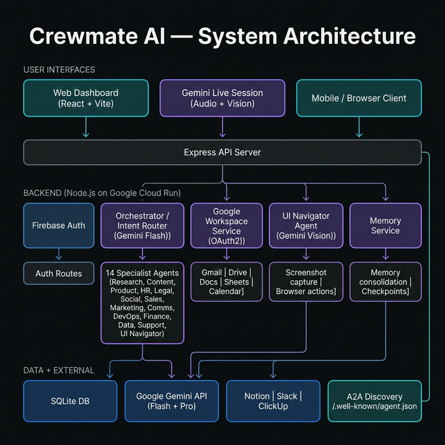
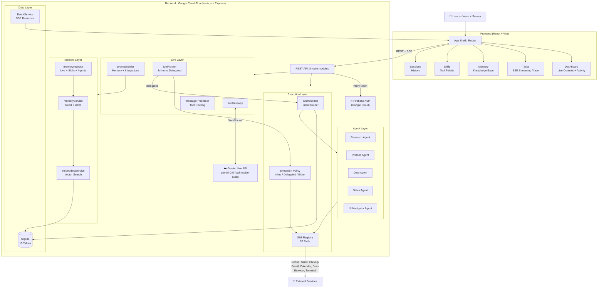
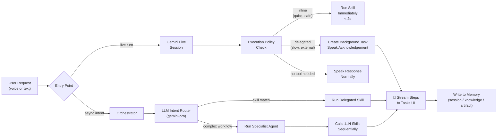
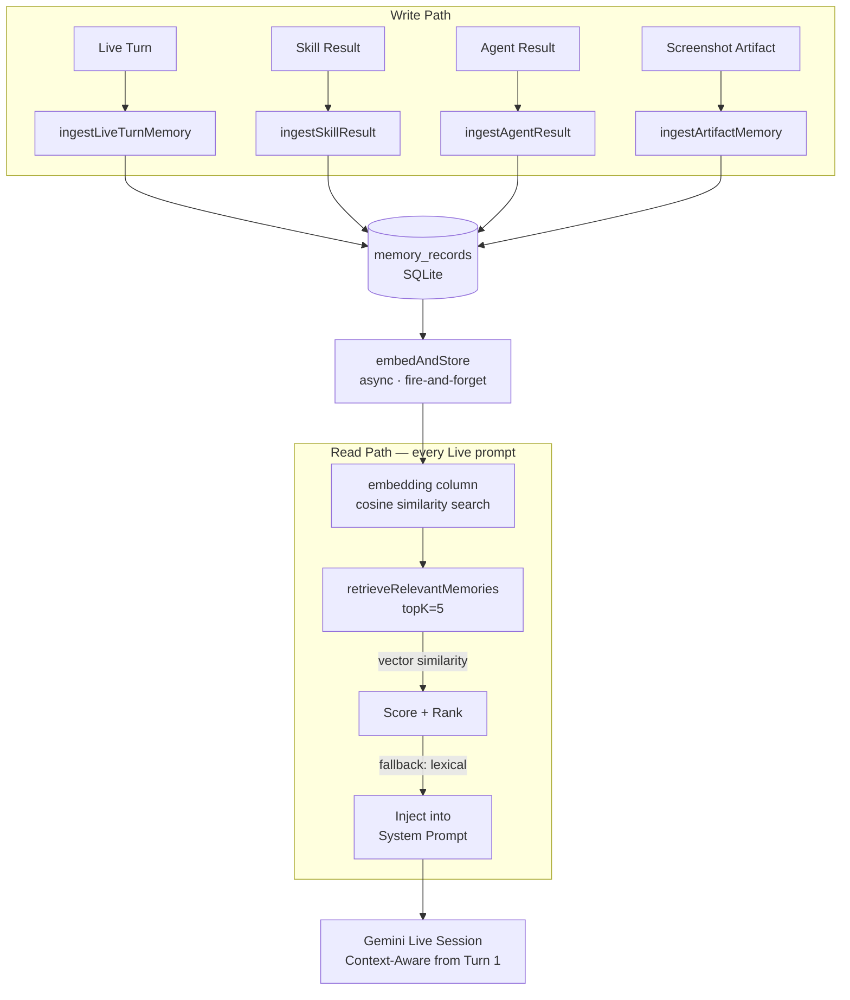
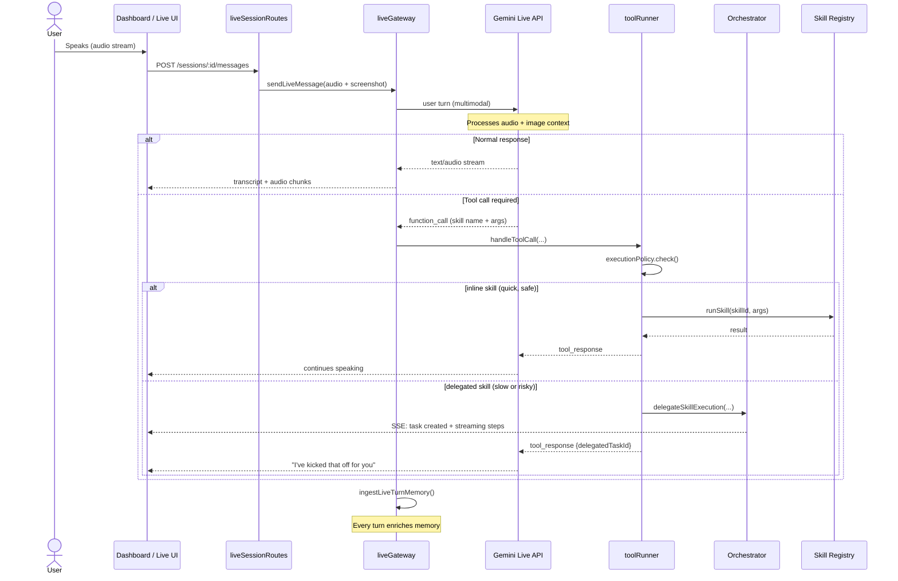

<div align="center">

# ⚡ Crewmate


### *Your multimodal AI operator — sees your screen, hears your voice, acts on your behalf*

[](https://ai.google.dev/gemini-api/docs/live)
[](https://cloud.google.com)
[](https://devpost.com)

**Category: Live Agents 🗣️ + UI Navigator ☸️**

[Quick Start](#-quick-start) · [Architecture](#-architecture) · [Skills](#-skills-52-and-counting) · [Integrations](#-integrations) · [Deployment](#-deployment) · [Full Architecture Diagrams](docs/ARCHITECTURE.md)

</div>

---

## What is Crewmate?

Crewmate is a next-generation **multimodal AI operator** that goes far beyond a chatbot. It is always listening, sees your screen in real-time, and executes complex multi-step work on your behalf — across your tools, browser, and workspace — while you stay in the flow.

**The core idea is simple:** stop switching between apps. Talk to Crewmate like you talk to a colleague. It routes your intent to the right agent, uses the right tools, and reports back — all in real-time.

```
"Summarize my open ClickUp tasks, draft a Notion doc, and screenshot this page for context."
↓
Crewmate routes this across 3 skills, streams progress, and stores the result in memory.
```

### Built for the Gemini Live API

Crewmate is architected around the **Gemini Live API** as its conversational controller:

- 🎙️ **Real-time voice** — speak naturally, interrupt at any time
- 👁️ **Screen awareness** — live screen capture sent as multimodal context
- 🧠 **Always-on memory** — vector-backed session + knowledge recall injected into every prompt
- ⚡ **Delegated execution** — slow or high-impact work is spawned into background tasks, not blocking the live turn
- 🔄 **Session resumption** — Gemini sessions auto-reconnect on drop (`goAway`, `transport_error`, `socket_closed`)

---

## ✨ Feature Highlights

| Feature | Description |
|---|---|
| **Gemini Live** | Real-time audio conversation with interruption support |
| **Screen Context** | Screenshot captured and sent as multimodal context each turn |
| **52 Skills** | Research, browser, productivity, comms, automation, code, live |
| **Orchestrator** | Intent-routed A2A dispatch to specialist agents |
| **Memory** | Vector-embedded session recall + knowledge base |
| **Tasks** | Real-time streamed background task execution with SSE |
| **Task Cue Badge** | Live "Working on it" badge — survives page refresh, clears on completion/failure |
| **Integrations** | Notion, Slack, ClickUp, Google Workspace, GitHub |
| **Auth** | Firebase Auth (production) + dev magic-code login |
| **Audit Log** | Every skill run is recorded with timing, result, and origin |

---

## 🏗️ Architecture



> 📐 **Full architecture diagrams** (Mermaid flowcharts, sequence diagrams, memory flow, browser loop, execution policy): **[docs/ARCHITECTURE.md](docs/ARCHITECTURE.md)**

> **A2A Discoverable:** Crewmate exposes `/.well-known/agent.json` per Google's Agent-to-Agent protocol. Any A2A-compliant agent can discover Crewmate's 14 agents, skills, and API endpoints automatically.

### System Overview — Detailed Flow



### Request Routing Flow

Every user request follows a deterministic routing decision:



### Memory Architecture



### Live Session Sequence



---

## 🌐 Browser Navigation — Autonomous Web Agent

Crewmate includes an **autonomous browser operator** powered by Stagehand + Gemini multimodal vision. It can navigate websites, fill forms, click through UIs, dismiss overlays, extract data, and complete multi-step web workflows.

### How it works

Crewmate uses a **Perceive → Reason → Act** loop, running up to 30 steps:

```
1. PERCEIVE   screenshot + DOM elements + ARIA accessibility tree
       ↓
2. REASON     Gemini multimodal analyzes the current state and step history
              → chooses the next action
       ↓
3. ACT        Stagehand executes the action in a real Chromium browser
       ↓
4. REPEAT     until task is complete, blocked, or max steps reached
```

### Action repertoire

| Action | Description |
|---|---|
| `open_url` | Navigate to any URL |
| `click` | Click any element — with fallback selector chain |
| `clear_and_type` | Clear pre-filled inputs, then type new value |
| `type` | Append text into a field |
| `select_option` | Choose from native `<select>` dropdowns |
| `check` | Toggle checkboxes and radio buttons |
| `hover` | Hover to reveal sub-menus or tooltips |
| `press_key` | Send keyboard events (Enter, Tab, Escape, etc.) |
| `scroll` | Scroll up or down the page |
| `wait_for` | Wait for an element to appear in the DOM |
| `wait_for_url` | Wait for a URL change after redirect/submit |
| `dismiss_overlay` | Auto-dismiss cookie banners, GDPR popups, modals (27 known patterns) |
| `extract_text` | Read text from any element |
| `finish` | Mark task complete with a structured summary |
| `request_confirmation` | Pause for user approval before irreversible actions |

### Reliability features

- **Fallback selector chain** — if a CSS selector fails, tries `alternativeSelectors[]`, then a `text=...` locator
- **Retry on failure** — each action retries up to 2× with an 800ms gap before being logged as failed
- **Continues after failure** — a single bad selector doesn't abort the task; the planner sees the failure and adapts
- **Automatic overlay dismissal** — first page load triggers a silent sweep for cookie/GDPR/modal dismiss buttons
- **ARIA snapshot** — the accessibility tree is extracted alongside the screenshot for precise element targeting on SPAs and React apps
- **URL inference** — "Go to Lenny's podcast" resolves to `lennysnewsletter.com` automatically

### Example tasks

```
"Go to lenny's newsletter and sign me up with varun@example.com"
"Search Product Hunt for the top AI tools this week and summarize them"
"Screenshot the Vercel pricing page"
"Find the cheapest MacBook Pro on apple.com right now"
"Fill out the contact form on acme.com and send a meeting request"
```

### Voice-triggered

All browser navigation is **voice-activated via Gemini Live** — say the task out loud, and the UI Navigator agent handles everything in the background while you continue your conversation.

---

## ⚡ Skills — 52 and Counting

Skills are the **single execution primitive** in Crewmate. Every action — from posting a Slack message to filling a web form — is a skill.

| Category | Skills |
|---|---|
| **Research** | `web.search`, `web.summarize-url` |
| **Communication** | `slack.post-message`, `slack.list-channels`, `slack.get-messages`, `slack.send-dm` |
| **Automation** | `zapier.trigger`, `zapier.list` |
| **Productivity — Notion** | `notion.create-page`, `notion.append-blocks`, `notion.append-screenshot`, `notion.create-database-record`, `notion.list-pages`, `notion.search-pages`, `notion.update-page` |
| **Productivity — ClickUp** | `clickup.create-task`, `clickup.attach-screenshot`, `clickup.list-tasks` |
| **Productivity — Google Workspace** | Gmail (draft/send/search), Docs (create/append), Sheets (create/append-rows), Slides (create/add-slides), Drive (search/create-folder), Calendar (create-event/list-events) |
| **Productivity — Memory** | `memory.store`, `memory.retrieve`, `memory.list` |
| **Productivity — Tasks** | `tasks.list-active`, `tasks.cancel`, `workspace.create-task` |
| **Browser Automation** | `browser.open-url`, `browser.extract`, `browser.extract-text`, `browser.fill-form`, `browser.click-element`, `browser.inspect-visible-ui`, `browser.press-key`, `browser.search-google`, `browser.scroll-page`, `browser.screenshot`, `browser.type-into`, `browser.ui-navigate` |
| **Code & DevOps** | `terminal.run-command` (sandboxed) |
| **Live** | `live.capture-screenshot` |

### Skill Execution Policy

Each skill declares:
- **`executionMode`**: `inline` | `delegated` | `either`
- **`latencyClass`**: `quick` | `slow`  
- **`sideEffectLevel`**: `none` | `low` | `high`

The runtime uses these to automatically decide whether to run a skill immediately during the live turn or delegate it to a background task.

---

## 🤖 Specialist Agents — 14 World-Class Domain Experts

For complex multi-step workflows, Crewmate dispatches to **14 specialist agents**, each with a deep expert persona, multi-step research pipeline, and auto-integration with connected tools.

Every agent follows the same pipeline: **Research → Strategy → Generate → Save (Notion/ClickUp/Slack)**.

| Agent | Expert Persona | Output Types | Auto-Integrations |
|---|---|---|---|
| 🔬 **Research** | Intelligence analyst — multi-angle parallel searches, cross-source validation | Executive brief, deep report, bullets, fact-check | Notion |
| ✍️ **Content** | Senior content strategist | Blog, LinkedIn, Twitter thread, video script, whitepaper, email sequence, PRD, docs | Notion |
| 📣 **Marketing** | Growth & campaign strategist | GTM plan, ICP, positioning, campaign brief, A/B copy, social campaign | Notion |
| 📱 **Social** | Social media strategist | Twitter threads, LinkedIn posts, Instagram, content calendar, founder brand building | Notion |
| 👥 **HR** | Head of People & talent partner | JD with scoring rubric, interview guide, offer letter, 90-day onboarding, performance review, policy, culture guide | Notion |
| 🗂️ **Product** | Senior Product Manager | PRD (RICE scoring), user stories, feature spec with API contract, sprint plan, competitive analysis, roadmap | ClickUp + Notion |
| 🎧 **Support** | VP Customer Support | Customer response, FAQ, ticket triage, escalation report, support playbook, CS strategy | Slack (P0/P1 alerts) + Notion |
| 💼 **Sales** | Enterprise AE strategist | Personalized outreach, 4-email sequence, discovery guide (MEDDIC), battle card, objection playbook (LAER), proposal | Notion |
| 💰 **Finance** | CFO-level analyst | Financial model (3-scenario), budget, investor update, expense analysis, P&L report, invoice | Notion |
| ⚖️ **Legal** | In-house counsel | Contract review (🔴🟡🟢 risk flags), NDA analysis, Terms of Service, GDPR privacy policy, compliance checklist | Notion |
| 📧 **Communications** | Chief Communications Officer | Executive email, press release, internal announcement, newsletter, memo, crisis comms (3 versions), Slack/DM | Slack + Notion |
| ⚙️ **DevOps** | Staff Engineer & platform expert | Code review, architecture design, GitHub Actions CI/CD YAML, incident runbook, security audit (CVSS), Terraform IaC | Terminal + Notion |
| 📊 **Data** | Senior Data Scientist & analytics engineer | SQL (CTE-pattern), cohort/funnel analysis, A/B test with power calculation, metrics framework, data story, dashboard design | Notion |
| 🌐 **UI Navigator** | Autonomous browser operator | Multi-step web automation, data extraction, form filling, login flows, SPA navigation, content scraping | Browser (Stagehand + Playwright) |

All agents emit real-time step-by-step trace events streamed to the Tasks UI. Agents use the shared skill registry internally.

> **Intent routing is automatic.** Say *"Write a JD for a senior engineer"* and the orchestrator routes to the HR Agent, which detects `jd` type, extracts the role, researches market benchmarks, and saves the result to Notion — all without you specifying any of this.

---

## 🔌 Integrations

| Integration | Auth Method | Capabilities |
|---|---|---|
| **Notion** | OAuth 2.0 | Pages, databases, blocks, screenshots |
| **Slack** | OAuth 2.0 | Post messages, list channels |
| **ClickUp** | OAuth 2.0 | Create tasks, attach screenshots, list tasks |
| **Google Workspace** | OAuth 2.0 | Gmail, Calendar, Docs, Sheets, Slides, Drive |
| **GitHub** | Personal Access Token | Issues, PRs, repositories |

All integration credentials are encrypted at rest using AES encryption (`CREWMATE_ENCRYPTION_KEY`) before storage in SQLite.

---

## 🗄️ Database Schema

Crewmate uses **SQLite with 19 tables** for a zero-dependency, portable data layer:

```
users                   → User accounts
workspaces              → Team workspaces
workspace_members       → Membership + roles
sessions                → Live session records
session_messages        → Transcript per session
tasks                   → Task registry (delegated + manual)
task_runs               → Detailed run records with step JSON
activities              → Activity log feed
notifications           → In-app notification inbox
memory_records          → Vector-embedded memory store
integrations            → Installed integration metadata
integration_connections → Encrypted per-user integration configs
oauth_states            → OAuth PKCE state table
user_preferences        → Model + UX preferences per user
onboarding_profiles     → Onboarding completion state per user
screenshot_artifacts    → Screenshot metadata + access tokens
auth_codes              → Dev email-code auth tokens
auth_sessions           → Server-side session tokens
schema_migrations       → Applied migration tracking
```

---

## 🚀 Quick Start

### Prerequisites

- Node.js 20+
- A [Gemini API Key](https://aistudio.google.com/app/apikey)

### 1. Clone & Install

```bash
git clone https://github.com/your-org/crewmate.git
cd crewmate
npm install
```

### 2. Configure Environment

```bash
cp .env.example .env
```

Edit `.env` and fill in at minimum for the smallest local preview:

```env
# Minimum local mode
GOOGLE_API_KEY=your_gemini_api_key_here
```

That is enough to boot the app locally with:
- local dev email-code auth
- dashboard, tasks, memory, sessions, skills, agents pages
- Gemini-powered chat/live flows
- local browser skills
- SQLite-backed state on your machine

You do **not** need Firebase or Google Workspace just to explore the product locally.

Optional but recommended even in local mode:

```env
CREWMATE_ENCRYPTION_KEY=your_32_char_secret_here  # openssl rand -hex 16
PEXELS_API_KEY=your_pexels_api_key_here           # enables automatic stock images in Docs/Slides/Notion outputs
```

Add these later when you want hosted/shared auth or real external integrations:

```env
FIREBASE_PROJECT_ID=your_firebase_project_id
VITE_FIREBASE_API_KEY=your_firebase_web_api_key
VITE_FIREBASE_AUTH_DOMAIN=your-project.firebaseapp.com
VITE_FIREBASE_APP_ID=your_firebase_app_id
GOOGLE_WORKSPACE_CLIENT_ID=your_google_workspace_client_id
GOOGLE_WORKSPACE_CLIENT_SECRET=your_google_workspace_client_secret
```

### 3. Run

```bash
npm run dev
```

This starts:
- **Frontend** on `http://localhost:3000`
- **Backend API** on `http://localhost:8787`

On first run, the database is auto-created and migrated at `data/crewmate.db`.

### Minimum Local Mode

If you only set `GOOGLE_API_KEY`, Crewmate runs in a true local preview mode:

- sign in with the built-in dev email-code flow
- no Firebase setup required
- no Google Workspace OAuth required
- integrations stay optional and can be connected later from the Integrations page

If you keep Firebase values in `.env` for other workflows, you can still force
local preview auth with:

```env
VITE_FORCE_LOCAL_PREVIEW=true
```

That single flag is the easiest way to switch your existing `.env` into local
preview mode without deleting hosted Firebase / Cloud Run values.

It will:
- force local email-code auth
- ignore Firebase auth mode in the frontend
- use localhost assumptions for backend CORS/public URLs
- keep integrations optional

Then restart `npm run dev`.

What works in this mode:

- dashboard, tasks, sessions, memory, agents, and skills UI
- Gemini text/live workflows that only need your Gemini key
- local browser automation skills
- local workspace task creation and memory storage
- Notion / Google Workspace UI surfaces as optional setup targets

What does **not** work until you configure integrations:

- Firebase shared login
- Gmail / Docs / Sheets / Slides / Drive / Calendar actions
- Notion / Slack / ClickUp real external writes
- shared/public OAuth-based team testing

### 4. Shared Friend Testing

The recommended low-cost testing setup is:

- run frontend + backend locally with `npm run dev`
- expose only `http://localhost:3000` through one HTTPS tunnel
- leave `VITE_API_URL` blank so `/api` stays same-origin and Vite proxies to `:8787`
- set `CORS_ORIGIN`, `PUBLIC_APP_URL`, and `PUBLIC_WEB_APP_URL` to the same tunnel origin
- use Firebase Auth for shared login
- use Google Workspace OAuth as the first required integration baseline

Use the full runbook here:

- [docs/deployment-testing-runbook.md](/Users/varun/Desktop/Dev_projects/crewmate-dashboard%20copy/docs/deployment-testing-runbook.md)

### 5. (Optional) Seed Demo Data

For a fresh install with sample tasks, memories, and activities pre-loaded:

```bash
npm run seed
```

This inserts 3 sample tasks, 3 memory records, and 4 activity log entries — so the dashboard never looks empty during a demo.

In development mode, use any email only when `AUTH_EXPOSE_DEV_CODE=true`. In minimum local mode this is the default path. For shared friend testing, switch to Firebase Auth and disable dev-code auth.

---

## 🤝 Local Development & Testing

For local development and testing with friends before deploying:

1. local frontend + local backend (`npm run dev`)
2. one HTTPS tunnel on the frontend port
3. Firebase Auth for shared login
4. Google Workspace OAuth as the baseline integration

Detailed setup, env matrix, callback rules, smoke checks, and rollback steps:

- [docs/deployment-testing-runbook.md](/Users/varun/Desktop/Dev_projects/crewmate-dashboard%20copy/docs/deployment-testing-runbook.md)

---

## ☁️ Deployment

Crewmate is deployed on **Google Cloud** with a split-hosting architecture:

| Layer | Platform | Details |
|---|---|---|
| **Frontend** | Firebase Hosting | React + Vite SPA, global CDN, HTTPS |
| **Backend API** | Google Cloud Run | Node.js + Express container, auto-scaling, HTTPS |
| **Auth** | Firebase Authentication | JWT verification on every API request |
| **Live AI** | Gemini Live API (`gemini-2.5-flash-native-audio`) | Real-time audio + vision |
| **Text / Routing** | Gemini Pro via Google GenAI SDK | Orchestration, agents, embeddings |
| **Integrations** | Google Workspace APIs | Gmail, Calendar, Docs, Sheets, Slides, Drive |

### Deploy your own

**Backend → Google Cloud Run:**

```bash
# Build and push container
gcloud builds submit --tag gcr.io/$PROJECT_ID/crewmate-api

# Deploy to Cloud Run
gcloud run deploy crewmate-api \
  --image gcr.io/$PROJECT_ID/crewmate-api \
  --platform managed \
  --region us-central1 \
  --allow-unauthenticated \
  --set-secrets="GOOGLE_API_KEY=crewmate-gemini-key:latest,CREWMATE_ENCRYPTION_KEY=crewmate-enc-key:latest"
```

Or use the included script:

```bash
bash scripts/deploy-cloud-run.sh
```

**Frontend → Firebase Hosting:**

```bash
npm run build
firebase deploy --only hosting
```

Set `VITE_API_URL` to your Cloud Run service URL.

### Google Cloud services used

| Service | Usage |
|---|---|
| **Google Cloud Run** | Backend API container hosting |
| **Firebase Hosting** | Frontend SPA hosting (global CDN) |
| **Firebase Authentication** | User identity + JWT verification |
| **Google Gemini API** | Live audio/vision model, text models, embeddings |
| **Google GenAI SDK** | `@google/genai` v1.44.0 — all Gemini API calls |
| **Google Workspace APIs** | Gmail, Calendar, Docs, Sheets, Slides, Drive via OAuth |

### Pre-deploy checklist

- run `npm run lint`
- run `npm test`
- run `npm run build`
- run `npm run test:smoke`
- confirm Firebase Auth is configured
- confirm the current public origin matches all callback URLs
- confirm `AUTH_EXPOSE_DEV_CODE=false` before any production deploy
- smoke-test login, dashboard, SSE, live session, delegated tasks, and Google Workspace OAuth

---

## 🔐 Environment Variables Reference

| Variable | Required | Description |
|---|---|---|
| `GOOGLE_API_KEY` | ✅ | Gemini API key |
| `CREWMATE_ENCRYPTION_KEY` | ✅ | 32-char secret for credential encryption |
| `PORT` | ⬜ | Server port (default: `8787`) |
| `CORS_ORIGIN` | ⬜ | Frontend origin or shared tunnel origin |
| `PUBLIC_APP_URL` | ⬜ | Public app origin used for backend-generated URLs |
| `PUBLIC_WEB_APP_URL` | ⬜ | Public frontend origin used for OAuth callback returns |
| `AUTH_EXPOSE_DEV_CODE` | ⬜ | Dev email-code auth toggle; keep `false` for shared/public testing |
| `FIREBASE_PROJECT_ID` | ⬜ | Firebase project for token verification |
| `FIREBASE_CLIENT_EMAIL` | ⬜ | Firebase service account email if not using ADC |
| `FIREBASE_PRIVATE_KEY` | ⬜ | Firebase service account private key if not using ADC |
| `VITE_FIREBASE_API_KEY` | ⬜ | Firebase web API key |
| `VITE_FIREBASE_AUTH_DOMAIN` | ⬜ | Firebase web auth domain |
| `VITE_FIREBASE_APP_ID` | ⬜ | Firebase web app ID |
| `GOOGLE_WORKSPACE_CLIENT_ID` | ⬜ | OAuth client for Google Workspace |
| `GOOGLE_WORKSPACE_CLIENT_SECRET` | ⬜ | OAuth secret for Google Workspace |
| `GOOGLE_WORKSPACE_REDIRECT_URI` | ⬜ | Google Workspace callback URL |
| `TAVILY_API_KEY` | ⬜ | AI-optimized web search (falls back to DuckDuckGo) |

See [.env.example](/Users/varun/Desktop/Dev_projects/crewmate-dashboard%20copy/.env.example) for the complete list and [docs/deployment-testing-runbook.md](/Users/varun/Desktop/Dev_projects/crewmate-dashboard%20copy/docs/deployment-testing-runbook.md) for mode-by-mode guidance.

For a full hosted deployment walkthrough, including Firebase Auth setup, backend/frontend deploy order, callback URLs, and cost-safety guardrails, see [docs/production-deployment-runbook.md](/Users/varun/Desktop/Dev_projects/crewmate-dashboard%20copy/docs/production-deployment-runbook.md).

---

## 🧪 Testing

```bash
# Type-check (TypeScript)
npm run lint

# Run all unit tests
npm run test

# Run smoke tests (production readiness checks)
npm run test:smoke
```

Tests are in `*.test.ts` files alongside their source files. The smoke test suite validates startup config, DB connectivity, and key service contracts.

---

## 📁 Project Structure

```
crewmate/
├── server/                    # Node.js + Express backend
│   ├── routeModules/          # 8 REST route modules
│   ├── services/              # Core services
│   │   ├── liveGateway*.ts    # Gemini Live session management
│   │   ├── orchestrator.ts    # Task routing engine
│   │   ├── memoryService.ts   # Vector memory store
│   │   ├── memoryIngestor.ts  # Write paths for memory
│   │   ├── executionPolicy.ts # Inline vs delegated routing
│   │   ├── agents/            # Specialist agent definitions
│   │   └── ...                # Integration services (Notion, Slack, etc.)
│   ├── skills/                # 51 registered skills
│   │   ├── browser/           # Playwright-powered browser skills
│   │   ├── communication/     # Slack
│   │   ├── productivity/      # Notion, ClickUp, Google Workspace, Memory
│   │   ├── research/          # Web search + URL summarization
│   │   ├── code/              # Terminal execution
│   │   ├── creative/          # Creative generation
│   │   └── registry.ts        # Skill registry + runner
│   ├── repositories/          # DB query layer
│   ├── dbSchema.ts            # SQLite schema (16 tables)
│   └── config.ts              # Centralized config with env vars
│
├── src/                       # React + Vite frontend
│   ├── pages/                 # Route-level page components
│   │   ├── Dashboard.tsx      # Live session + activity
│   │   ├── Tasks.tsx          # Real-time task streaming
│   │   ├── MemoryBase.tsx     # Memory knowledge base
│   │   ├── Sessions.tsx       # Session history
│   │   ├── Skills.tsx         # Skill palette
│   │   ├── Integrations.tsx   # Integration management
│   │   └── Account.tsx        # Preferences + personas
│   ├── components/            # UI component library
│   ├── contexts/              # LiveSessionContext, AuthContext
│   ├── hooks/                 # useLiveSession, useSSE, etc.
│   └── services/              # Frontend API clients
│
├── AGENT_ARCHITECTURE.md      # Full architecture deep-dive
├── SOUL.md                    # Crewmate's identity and values
└── .env.example               # All environment variables documented
```

---

## 🧬 The Model Strategy

Crewmate uses a **multi-model routing strategy** to balance quality, speed, and cost across every use case:

| Role | Model | Used For |
|---|---|---|
| 🎙️ **Live audio** | `gemini-2.5-flash-native-audio-preview-12-2025` | Real-time bidirectional voice + screen sessions |
| 🔬 **Research & agents** | `gemini-3.1-pro-preview` | All 13 specialist agents, deep research, multi-step reasoning |
| 🧠 **Orchestration** | `gemini-3.1-pro-preview` | Intent classification, A2A routing decisions |
| ⚡ **Text & quick tasks** | `gemini-3.1-flash-lite-preview` | Inline skill calls, fast responses, confirmations |
| 🎨 **Creative / images** | `gemini-3.1-flash-image-preview` | Image generation, creative content |
| 💬 **Lite / filler** | `gemini-3.1-flash-lite-preview` | Acknowledgements, simple Q&A |

All models can be overridden via environment variables (`GEMINI_LIVE_MODEL`, `GEMINI_RESEARCH_MODEL`, etc.).

---

## 🙏 Acknowledgments

Built for the **Gemini Live Agent Challenge** hackathon.

Powered by:
- [Google Gemini Live API](https://ai.google.dev/gemini-api/docs/live)
- [Google GenAI SDK](https://www.npmjs.com/package/@google/genai)
- [Firebase](https://firebase.google.com)
- [React](https://react.dev) + [Vite](https://vitejs.dev)
- [Stagehand](https://github.com/browserbasehq/stagehand) (AI-native browser automation)
- [Playwright](https://playwright.dev) (browser foundation)
- [better-sqlite3](https://github.com/WiseLibs/better-sqlite3)

---

<div align="center">

**Stop typing. Start operating.**

*Crewmate — From Static Chatbots to Immersive Experiences*

</div>
