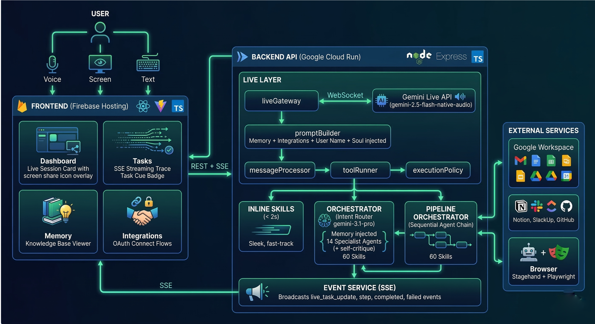
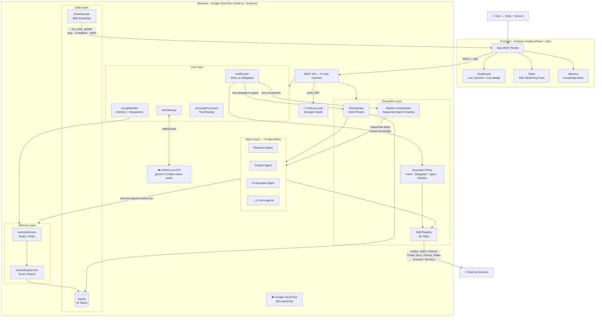
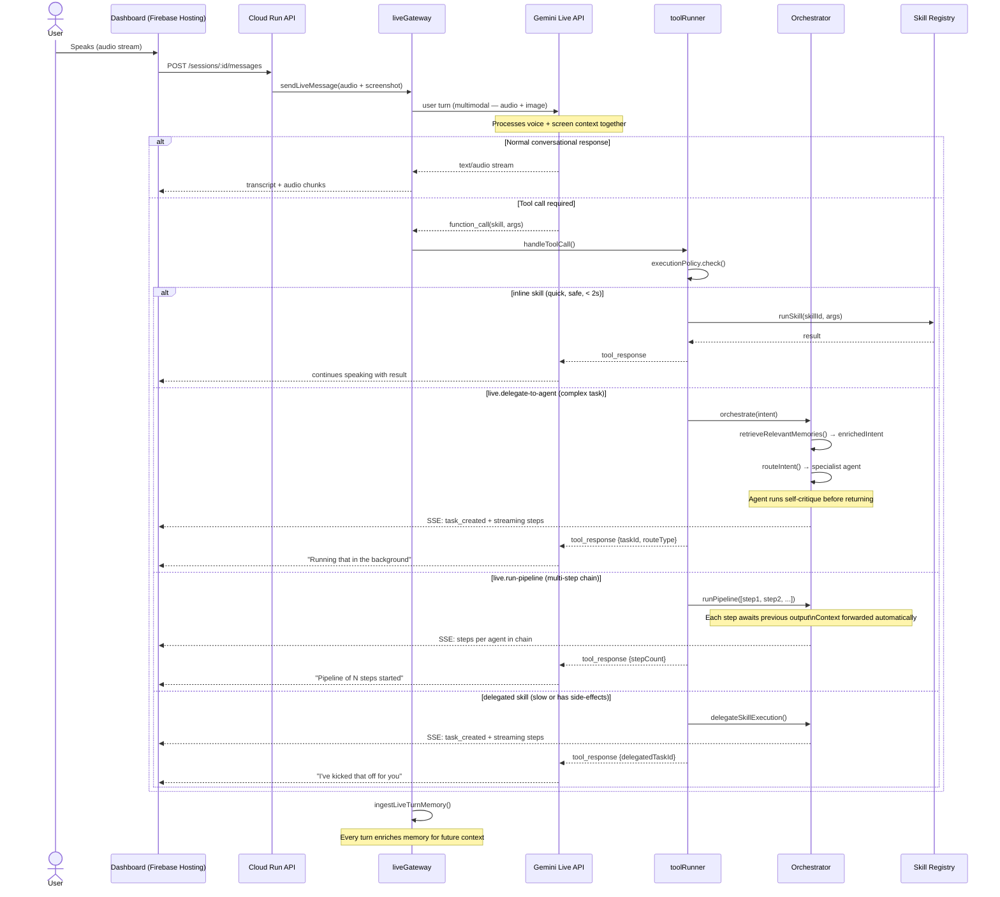
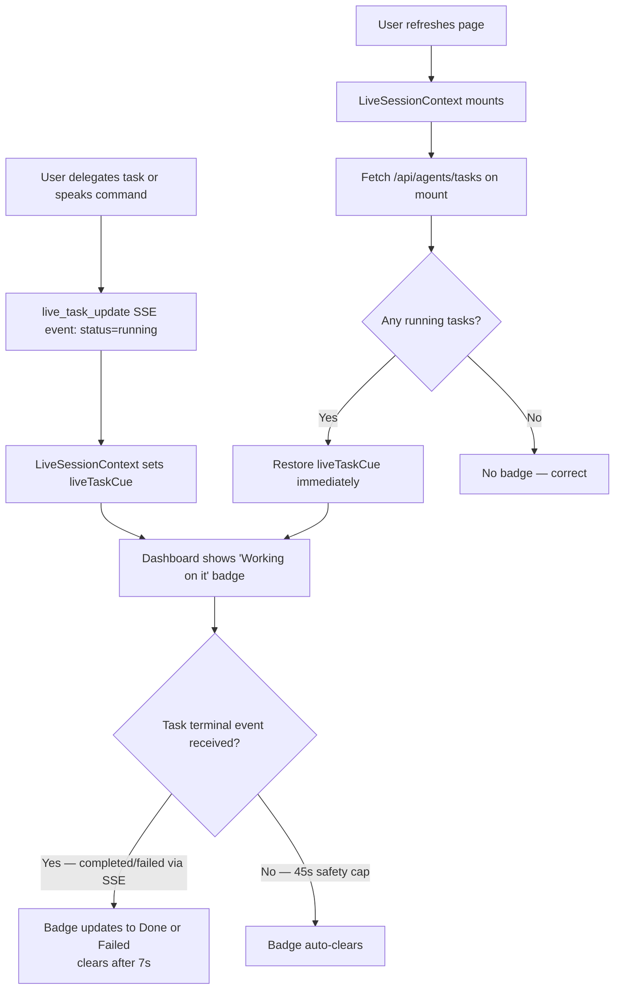
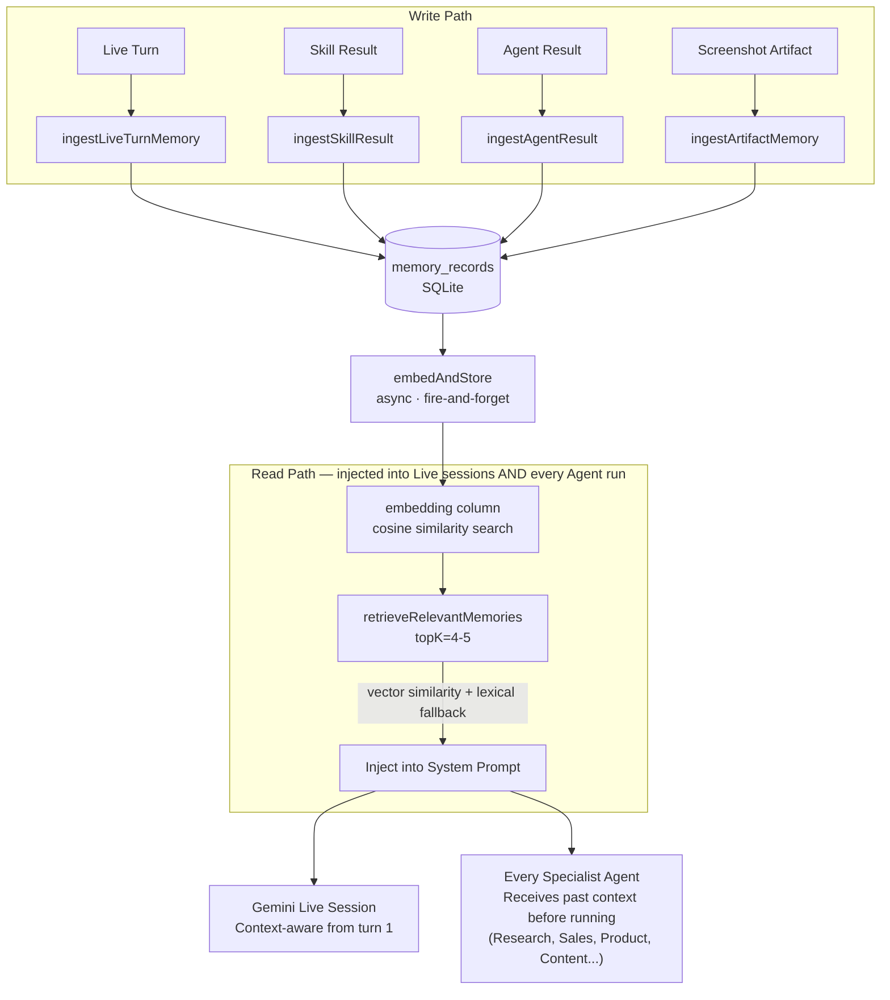
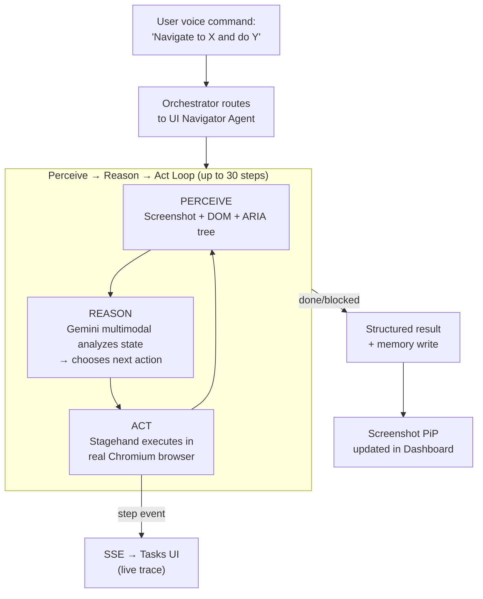
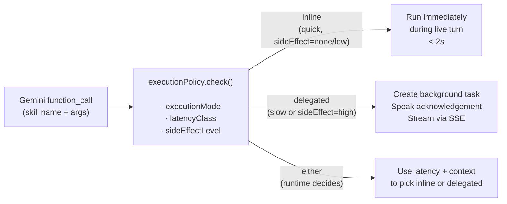

# Crewmate — Architecture

> **Gemini Live Agent Challenge** · Category: Live Agents 🗣️ + UI Navigator ☸️

---

## System Overview

Crewmate is a multimodal AI remote employee. It connects a real-time Gemini Live session (voice + screen) to a full backend orchestration layer. Voice commands reach 14 specialist agents, read and write real documents, chain into multi-step pipelines, and report progress in real-time — all while remembering context from past sessions.

**What's changed recently:**
- Live sessions can now reach all 14 specialist agents via `live.delegate-to-agent`
- Agents chain sequentially via `live.run-pipeline` with context passed between steps
- Every agent run gets relevant memory injected before starting
- Agents perform a self-critique pass before returning output
- Full document reading: Google Docs, Sheets, Slides, Notion pages, Gmail bodies
- Editable Soul: user name + custom personality injected into every agent and live prompt
- Firebase OAuth race condition fixed — no more logout after Google Workspace connect





```
┌─────────────────────────────────────────────────────────────────┐
│                          USER                                   │
│                  Voice  ·  Screen  ·  Text                      │
└───────────────────────────┬─────────────────────────────────────┘
                            │
                            ▼
┌─────────────────────────────────────────────────────────────────┐
│                FRONTEND  (Firebase Hosting)                      │
│                React + Vite + TypeScript                         │
│                                                                  │
│   Dashboard ── Live Session Card ── Screen Share Overlay         │
│   Tasks ─────── SSE Streaming Trace ── Task Cue Badge            │
│   Memory ─────── Knowledge Base Viewer                          │
│   Integrations ─ OAuth Connect Flows                            │
└───────────────────────────┬─────────────────────────────────────┘
                            │  REST + SSE
                            ▼
┌─────────────────────────────────────────────────────────────────┐
│               BACKEND API  (Google Cloud Run)                    │
│                Node.js + Express + TypeScript                    │
│                                                                  │
│  ┌──────────────────────────────────────────────────────────┐   │
│  │                    LIVE LAYER                            │   │
│  │                                                          │   │
│  │  liveGateway ◄──── WebSocket ────► Gemini Live API       │   │
│  │       │                           (gemini-2.5-flash-     │   │
│  │       │                            native-audio)         │   │
│  │  promptBuilder                                           │   │
│  │  (Memory + Integrations + User Name + Soul injected)     │   │
│  │       │                                                  │   │
│  │  messageProcessor ── toolRunner                          │   │
│  │                           │                             │   │
│  │               ┌───────────┴────────────┐                │   │
│  │               │  executionPolicy       │                │   │
│  │               │  inline / delegated /  │                │   │
│  │               │  delegate-to-agent /   │                │   │
│  │               │  run-pipeline          │                │   │
│  │               └───────────┬────────────┘                │   │
│  └───────────────────────────┼──────────────────────────────┘   │
│                              │                                   │
│     ┌────────────────────────┼─────────────────────┐            │
│     │                        │                     │            │
│     ▼                        ▼                     ▼            │
│  ┌──────────┐   ┌────────────────────────┐  ┌──────────────┐   │
│  │  INLINE  │   │     ORCHESTRATOR       │  │ PIPELINE     │   │
│  │  SKILLS  │   │  Intent Router         │  │ ORCHESTRATOR │   │
│  │  (< 2s)  │   │  (gemini-3.1-pro)      │  │ Sequential   │   │
│  └──────────┘   │                        │  │ Agent Chain  │   │
│                 │  Memory injected →     │  └──────────────┘   │
│                 │  14 Specialist Agents  │         │           │
│                 │  (+ self-critique)     │         │           │
│                 │                        │         │           │
│                 │  60 Skills             │←────────┘           │
│                 └────────────┬───────────┘                     │
│                               │                                  │
│                               ▼                                  │
│                    ┌──────────────────────┐                     │
│                    │   EXTERNAL SERVICES  │                     │
│                    │                      │                     │
│                    │  Google Workspace    │                     │
│                    │  (Gmail, Docs,       │                     │
│                    │   Sheets, Slides,    │                     │
│                    │   Drive, Calendar)   │                     │
│                    │                      │                     │
│                    │  Notion · Slack      │                     │
│                    │  ClickUp · GitHub    │                     │
│                    │                      │                     │
│                    │  Browser (Stagehand  │                     │
│                    │  + Playwright)       │                     │
│                    └──────────────────────┘                     │
│                                                                  │
│  ┌──────────────────────────────────────────────────────────┐   │
│  │               EVENT SERVICE (SSE)                        │   │
│  │   Broadcasts live_task_update, step, completed,          │   │
│  │   failed events back to connected frontend clients       │   │
│  └──────────────────────────────────────────────────────────┘   │
└─────────────────────────────────────────────────────────────────┘
```

---

## Google Cloud Services

| Service | Role |
|---|---|
| **Google Cloud Run** | Hosts the Node.js backend API — containerised, auto-scaling, HTTPS |
| **Firebase Hosting** | Hosts the React frontend — global CDN, instant deploy |
| **Firebase Authentication** | JWT-based user auth — token verified on every API request |
| **Gemini Live API** | Real-time audio + vision model (`gemini-2.5-flash-native-audio`) |
| **Google GenAI SDK** | `@google/genai` v1.44.0 — all Gemini model calls |
| **Google Workspace APIs** | Gmail, Calendar, Docs, Sheets, Slides, Drive (OAuth 2.0) |

---

## Request Flow — Full Mermaid Diagram



---

## Live Session Sequence

How a voice command becomes a real-world action:



---

## Task Cue Reliability Flow

How the "Working on it" badge stays accurate across page refreshes:



---

## Memory Architecture



---

## UI Navigator — Browser Automation Loop



---

## Execution Policy Decision

Every Gemini tool call goes through the same policy gate:



---

## Agent Quality Architecture

Every specialist agent now runs through a consistent quality pipeline:

```
1. MEMORY INJECTION
   retrieveRelevantMemories(userId, intent, 4)
   → Past work, preferences, company context prepended to the intent
       ↓
2. ROUTING
   LLM classifies intent → picks specialist agent (Research, Sales, Product, etc.)
       ↓
3. AGENT EXECUTION
   Agent runs multi-step reasoning with skills (search, read docs, write docs)
       ↓
4. SELF-CRITIQUE (built into every agent system prompt)
   Before returning: "Does this fully answer the question? Are claims backed by data?
   Is this immediately usable? Is anything obviously missing?" → improve if not.
       ↓
5. OUTPUT + SAVE
   Result saved to Notion/ClickUp/Slack as appropriate
   Result ingested into memory for future sessions
```

---

## Document Reading Layer

Crewmate can now read real content from all major document types:

| Source | Skill | Returns |
|---|---|---|
| Google Docs | `google.docs-read-document` | Full plain text |
| Google Sheets | `google.sheets-read-spreadsheet` | All sheets, rows/cells (up to 200 rows per sheet) |
| Google Slides | `google.slides-read-presentation` | All slide titles + body text |
| Gmail | `google.gmail-read-message` | Subject, from, to, date, full decoded body |
| Notion | `notion.read-page` | All block content as plain text |

This enables flows like: *"Read my Q3 strategy doc, then research our competitors, then write a PRD"* — the agent actually understands what's in the doc before acting.

---

## Agent Pipeline (Sequential Chaining)

`live.run-pipeline` lets voice commands trigger a chain of agents where each step feeds into the next:

```
User: "Research our top 3 competitors, then write a battle card, then draft an outreach email"
↓
Pipeline step 1: Research Agent → competitor analysis
Pipeline step 2: Sales Agent    → receives step 1 output as context → battle card
Pipeline step 3: Sales Agent    → receives step 2 output as context → outreach email
```

Each step runs `orchestrate()` with the previous step's output appended. Steps time out at 5 minutes each. On failure, the pipeline stops and reports which step failed.

---

## Tech Stack Summary

| Layer | Technology |
|---|---|
| Frontend | React 19, Vite, TypeScript, Tailwind CSS, Motion (v12) |
| Backend | Node.js, Express, TypeScript |
| AI | Gemini 2.5 Flash Live (audio/vision), `gemini-3.1-pro-preview` (agents/orchestration), `gemini-3.1-flash-lite-preview` (inline/quick), `gemini-embedding-2` (memory), @google/genai SDK |
| Database | SQLite (19 tables, vector embeddings column) |
| Auth | Firebase Authentication (JWT) + dev email-code login |
| Browser Automation | Stagehand + Playwright + Chromium |
| Hosting | Google Cloud Run (backend) · Firebase Hosting (frontend) |
| Integrations | Google Workspace (full read+write), Notion, Slack (inc. DMs), ClickUp, GitHub |
| Real-time | Server-Sent Events (SSE) for task streaming |
| Memory | Vector similarity search (cosine) with lexical fallback — injected into live sessions AND agent runs |
