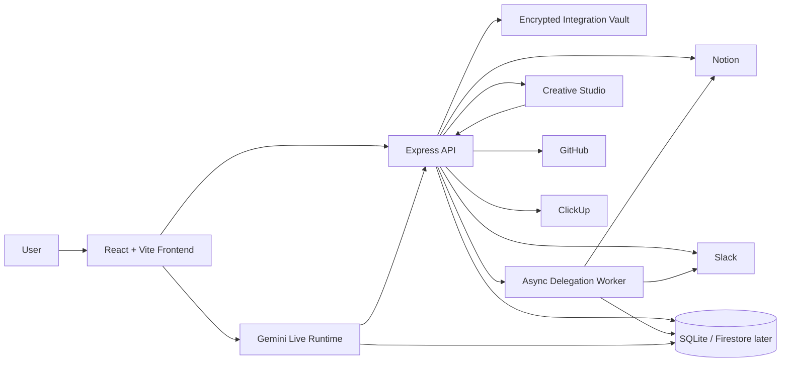

# Crewmate Architecture

## Runtime Lanes

- `Live Agent`: screen + mic -> Gemini Live -> tool calls -> transcript, tasks, notifications, memory
- `Delegations`: queued brief -> orchestrator -> researcher -> editor -> Notion/Slack handoff
- `Creative Studio`: prompt -> multimodal generation -> narrative + image artifact

## Google Tech

- `@google/genai` SDK
- Gemini Live for realtime screen/audio sessions
- Gemini text generation for delegated jobs
- Gemini multimodal generation for creative artifact output
- intended deployment target: `Google Cloud Run`
