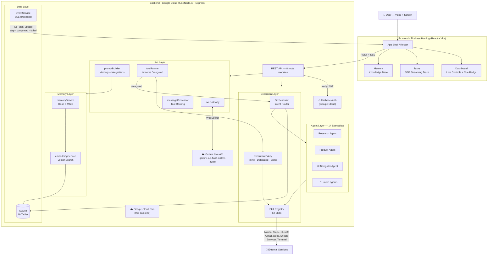
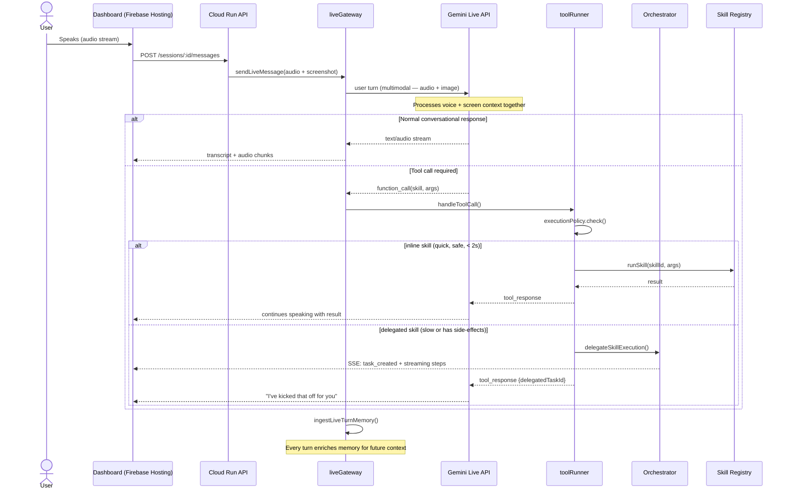
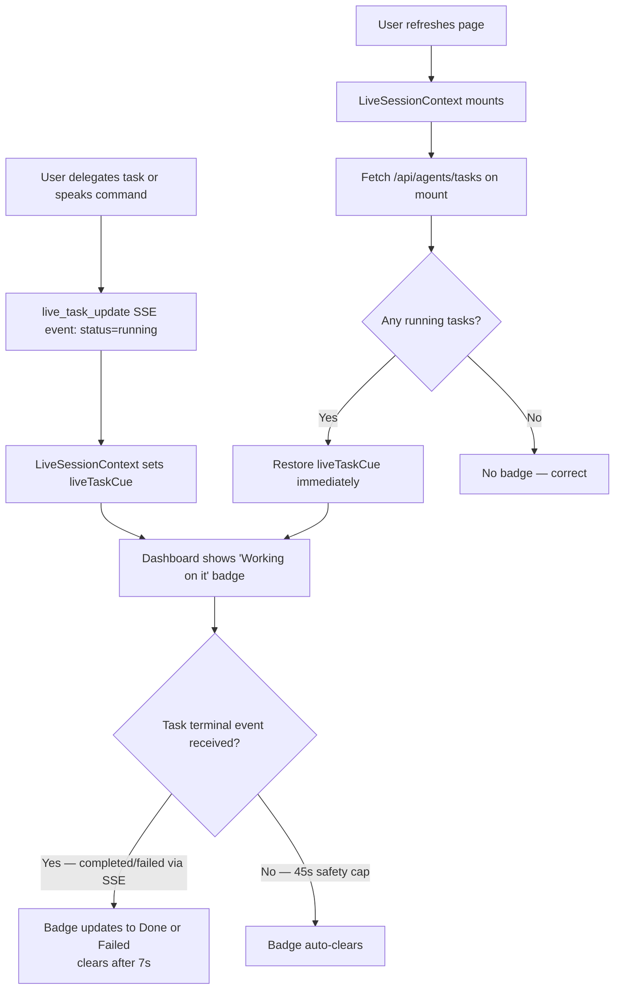
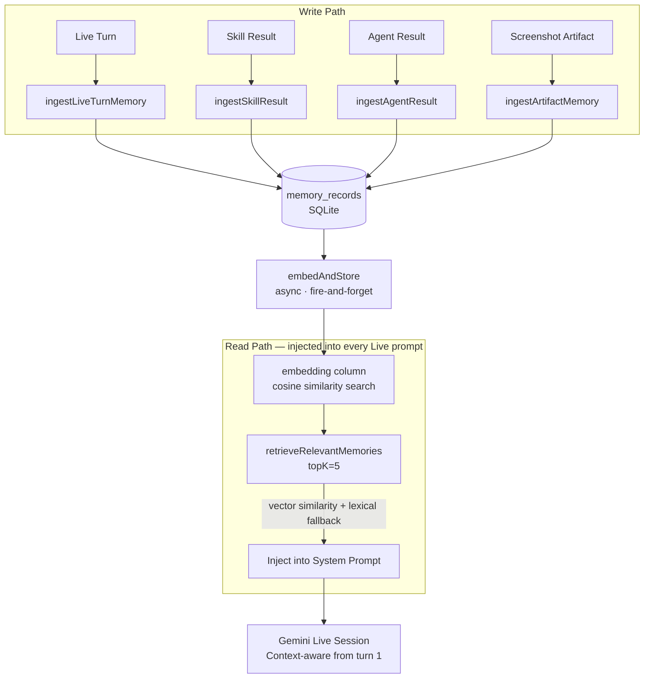
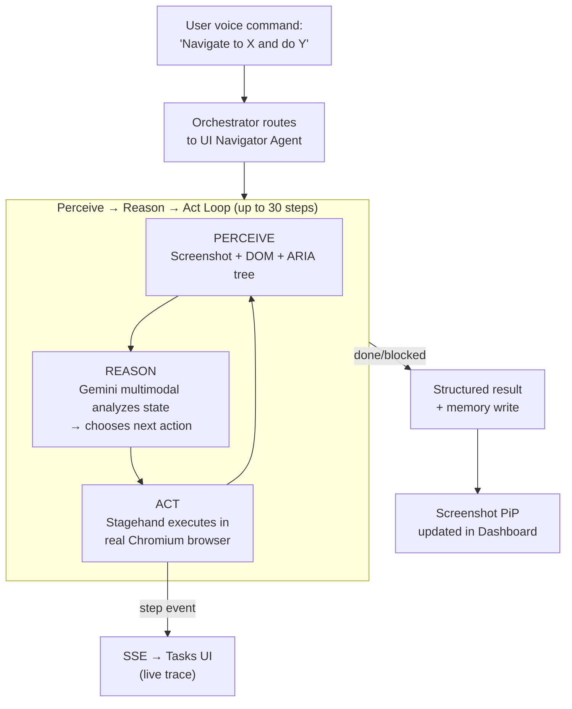
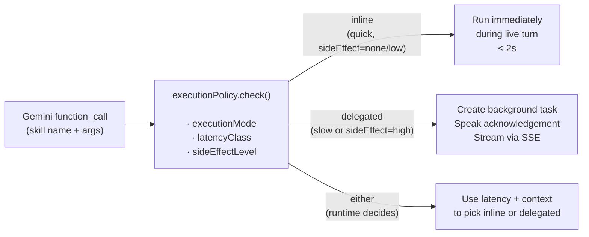

# Crewmate — Architecture

> **Gemini Live Agent Challenge** · Category: Live Agents 🗣️ + UI Navigator ☸️

---

## System Overview

Crewmate is a multimodal AI operator. It connects a real-time Gemini Live session (voice + screen) to a full backend orchestration layer, enabling natural spoken commands to trigger complex multi-step work across any connected tool or browser — all while reporting progress back in real-time.

```
┌─────────────────────────────────────────────────────────────────┐
│                          USER                                   │
│                  Voice  ·  Screen  ·  Text                      │
└───────────────────────────┬─────────────────────────────────────┘
                            │
                            ▼
┌─────────────────────────────────────────────────────────────────┐
│                FRONTEND  (Firebase Hosting)                      │
│                React + Vite + TypeScript                         │
│                                                                  │
│   Dashboard ── Live Session Card ── Screen Share Overlay         │
│   Tasks ─────── SSE Streaming Trace ── Task Cue Badge            │
│   Memory ─────── Knowledge Base Viewer                          │
│   Integrations ─ OAuth Connect Flows                            │
└───────────────────────────┬─────────────────────────────────────┘
                            │  REST + SSE
                            ▼
┌─────────────────────────────────────────────────────────────────┐
│               BACKEND API  (Google Cloud Run)                    │
│                Node.js + Express + TypeScript                    │
│                                                                  │
│  ┌──────────────────────────────────────────────────────────┐   │
│  │                    LIVE LAYER                            │   │
│  │                                                          │   │
│  │  liveGateway ◄──── WebSocket ────► Gemini Live API       │   │
│  │       │                           (gemini-2.5-flash-     │   │
│  │       │                            native-audio)         │   │
│  │  promptBuilder                                           │   │
│  │  (Memory + Integrations injected into every prompt)      │   │
│  │       │                                                  │   │
│  │  messageProcessor ── toolRunner                          │   │
│  │                           │                             │   │
│  │               ┌───────────┴────────────┐                │   │
│  │               │  executionPolicy       │                │   │
│  │               │  inline? delegated?    │                │   │
│  │               └───────────┬────────────┘                │   │
│  └───────────────────────────┼──────────────────────────────┘   │
│                              │                                   │
│          ┌───────────────────┼──────────────────┐               │
│          │                   │                  │               │
│          ▼                   ▼                  ▼               │
│   ┌─────────────┐   ┌─────────────────┐  ┌──────────────────┐  │
│   │   INLINE    │   │  ORCHESTRATOR   │  │  MEMORY LAYER    │  │
│   │   SKILLS    │   │  Intent Router  │  │                  │  │
│   │  (< 2s,     │   │  (gemini-pro)   │  │  memoryService   │  │
│   │   safe)     │   │       │         │  │  embeddingService│  │
│   └─────────────┘   │  14 Specialist  │  │  SQLite          │  │
│                      │  Agents         │  │  (vector search) │  │
│                      │       │         │  └──────────────────┘  │
│                      │  52 Skills      │                        │
│                      └────────┬────────┘                        │
│                               │                                  │
│                               ▼                                  │
│                    ┌──────────────────────┐                     │
│                    │   EXTERNAL SERVICES  │                     │
│                    │                      │                     │
│                    │  Google Workspace    │                     │
│                    │  (Gmail, Docs,       │                     │
│                    │   Sheets, Slides,    │                     │
│                    │   Drive, Calendar)   │                     │
│                    │                      │                     │
│                    │  Notion · Slack      │                     │
│                    │  ClickUp · GitHub    │                     │
│                    │                      │                     │
│                    │  Browser (Stagehand  │                     │
│                    │  + Playwright)       │                     │
│                    └──────────────────────┘                     │
│                                                                  │
│  ┌──────────────────────────────────────────────────────────┐   │
│  │               EVENT SERVICE (SSE)                        │   │
│  │   Broadcasts live_task_update, step, completed,          │   │
│  │   failed events back to connected frontend clients       │   │
│  └──────────────────────────────────────────────────────────┘   │
└─────────────────────────────────────────────────────────────────┘
```

---

## Google Cloud Services

| Service | Role |
|---|---|
| **Google Cloud Run** | Hosts the Node.js backend API — containerised, auto-scaling, HTTPS |
| **Firebase Hosting** | Hosts the React frontend — global CDN, instant deploy |
| **Firebase Authentication** | JWT-based user auth — token verified on every API request |
| **Gemini Live API** | Real-time audio + vision model (`gemini-2.5-flash-native-audio`) |
| **Google GenAI SDK** | `@google/genai` v1.44.0 — all Gemini model calls |
| **Google Workspace APIs** | Gmail, Calendar, Docs, Sheets, Slides, Drive (OAuth 2.0) |

---

## Request Flow — Full Mermaid Diagram



---

## Live Session Sequence

How a voice command becomes a real-world action:



---

## Task Cue Reliability Flow

How the "Working on it" badge stays accurate across page refreshes:



---

## Memory Architecture



---

## UI Navigator — Browser Automation Loop



---

## Execution Policy Decision

Every Gemini tool call goes through the same policy gate:



---

## Tech Stack Summary

| Layer | Technology |
|---|---|
| Frontend | React 18, Vite, TypeScript, Tailwind CSS, Framer Motion |
| Backend | Node.js, Express, TypeScript |
| AI | Google Gemini Live API, Gemini Pro (routing/agents), Google GenAI SDK |
| Database | SQLite (16 tables, vector embeddings column) |
| Auth | Firebase Authentication (JWT) |
| Browser Automation | Stagehand + Playwright + Chromium |
| Hosting | Google Cloud Run (backend) · Firebase Hosting (frontend) |
| Integrations | Google Workspace, Notion, Slack, ClickUp, GitHub |
| Real-time | Server-Sent Events (SSE) for task streaming |
| Memory | Vector similarity search (cosine) with lexical fallback |
