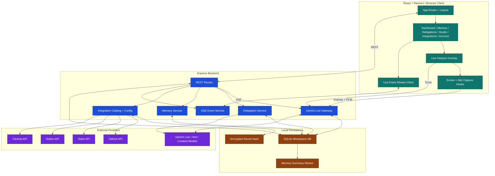
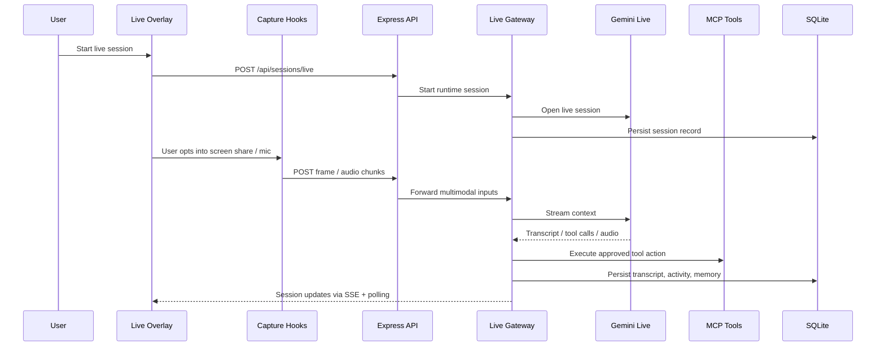
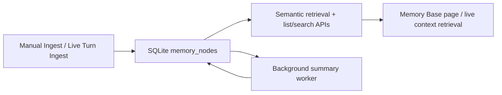

# Crewmate Architecture

## System Map

## Runtime Flow

### 1. App startup

- `src/main.tsx` initializes theme before React mounts.
- `src/App.tsx` mounts the router and preloads route chunks in the background.
- `src/components/layout/MainLayout.tsx` applies authenticated app chrome and persistent theme state.

### 2. Live session flow

## Memory Architecture

The memory system is not a single page feature. It spans ingestion, retrieval, live-turn capture, and background summarization.

### Memory data sources

- manual context entered from the UI
- live-turn conversation checkpoints
- background summarization output
- integration-derived context over time

### Memory pipeline

## Delegation Architecture

Delegated jobs are queued separately from the live operator loop so async work does not block a session.

### Job stages

1. UI queues a research brief
2. backend writes job to SQLite
3. background worker picks it up
4. model-driven execution runs
5. results are written back to SQLite and optionally delivered to tools
6. notifications and SSE updates are emitted

## Integration Architecture

Each integration is modeled in three layers:

### Catalog

- display metadata
- readiness state
- capability descriptions
- setup requirements

### Config

- environment-variable fallback
- encrypted vault-backed user-saved config
- API endpoints for create, update, delete, and inspect

### Execution

- MCP tool registration
- live-tool execution from Gemini calls
- activity logging and failure handling

## Frontend Structure

### Presentation

- `src/pages/*`
- `src/components/ui/*`
- `src/components/layout/*`
- `src/components/*`

### Application hooks and services

- `src/hooks/*`
- `src/services/*`

### Important frontend runtime helpers

- `src/services/themeService.ts`
- `src/services/onboardingService.ts`
- `src/lib/api.ts`

## Backend Structure

### Routes and API surface

- `server/routes.ts`
- `server/index.ts`

### Service layer

- `server/services/liveGateway.ts`
- `server/services/memoryService.ts`
- `server/services/delegationService.ts`
- `server/services/integrationConfigService.ts`
- `server/services/notificationService.ts`
- `server/services/preferencesService.ts`

### Repository layer

- `server/repositories/*`

### MCP and tool layer

- `server/mcp/*`
- tool services in `server/services/*`

## Reliability and UX Hardening Already Applied

- route chunks are preloaded after startup to reduce suspense flashes
- theme is initialized before first paint
- screen and microphone capture are explicit user actions, not automatic prompts
- memory graph visualization degrades gracefully when browser APIs are unavailable
- API errors surface backend messages instead of only status codes
- test suite and typecheck are green

## Remaining Production Work

- hosted auth provider
- signed desktop release pipeline
- richer end-to-end smoke coverage
- production secrets management outside local `.env`
- observability and tracing for live session failures
